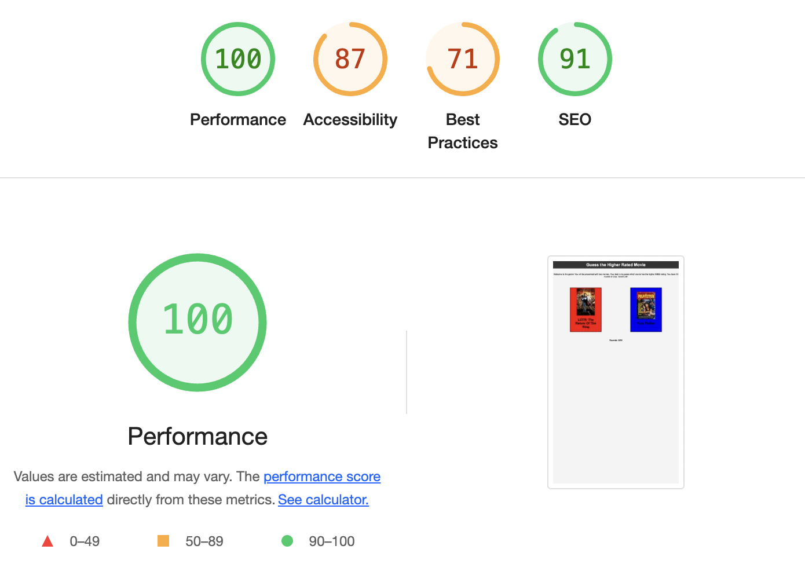
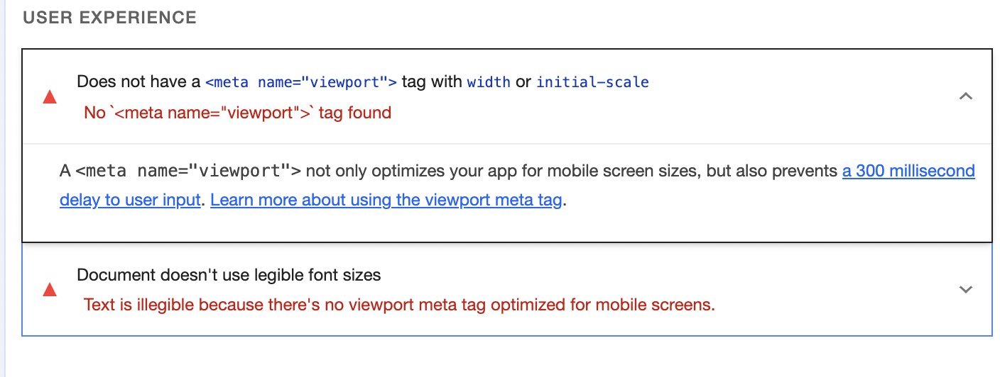
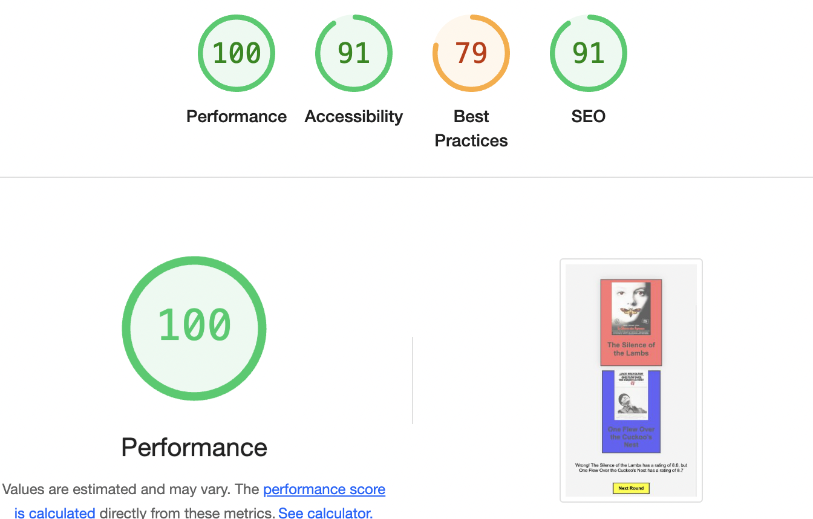
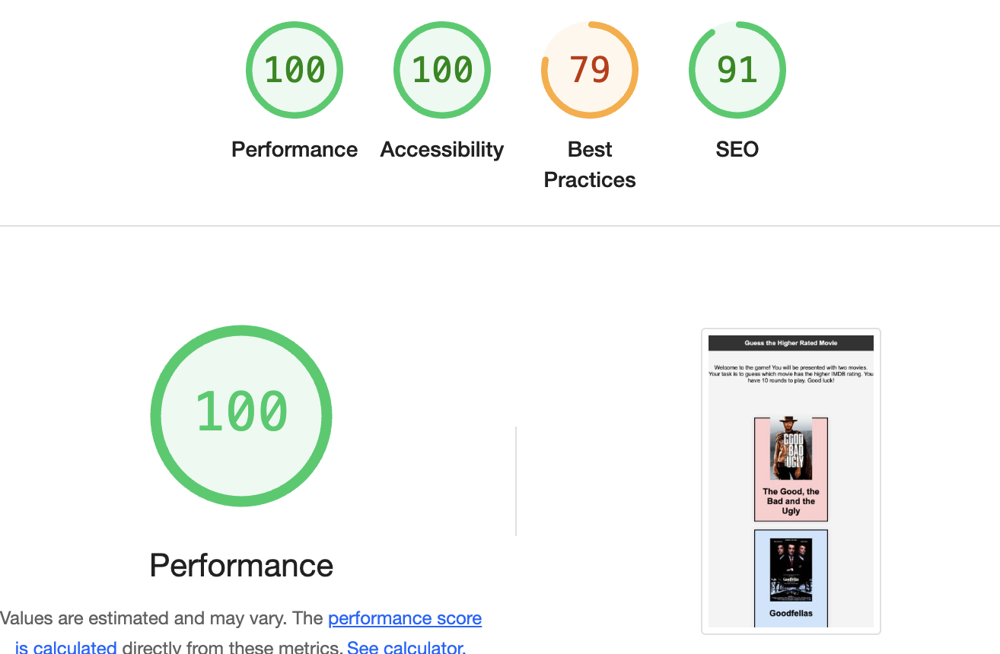

# Movie Rating Game

## Overview

Welcome to the Movie Rating Game! This game challenges you to guess which of two movies has a higher IMDb rating. You'll play 10 rounds, each featuring two different movies. Your goal is to guess correctly as many times as possible to achieve a high score and earn a title based on your performance.

## Features

- Display two random movies for each round.
- Allow users to guess which movie has a higher rating.
- Track score and rounds played.
- Show a "Next Round" button after each guess.
- Display the final score and title based on the user's performance.
- Titles: 
  - Cinephile (10/10)
  - Movie Buff (7-9/10)
  - Movie Fan (5-6/10)
  - Normie (0-4/10)
- Responsive design for various screen sizes.

## Technologies Used

- HTML
- CSS
- JavaScript

## How to Play

1. You will be presented with two movies.
2. Click on the movie you think has the higher IMDb rating.
3. After guessing, you will see whether your guess was correct or not.
4. Click the "Next Round" button to proceed to the next pair of movies.
5. After 10 rounds, click the "Show Score" button to see your final score and title.

## Files and Directories

- `index.html`: The main HTML file for the game.
- `score.html`: The HTML file for displaying the final score.
- `assets/css/styles.css`: CSS file for styling the game page.
- `assets/css/score-styles.css`: CSS file for styling the score page.
- `assets/js/script.js`: JavaScript file containing the game logic.
- `assets/js/score-script.js`: JavaScript file containing the score page logic.
- `assets/images/`: Directory containing movie images.

## Setup

1. Clone the repository to your local machine.
2. Open `index.html` in your web browser to start the game.

## Testing

- Lighthouse Dev Tools

Testing in Lighthouse returned undesirable results.

As we can see there was no viewport code. After I added the initial viewport structure I got the following score.

And then I added the media queries as well as changed the font size and got the following score.

