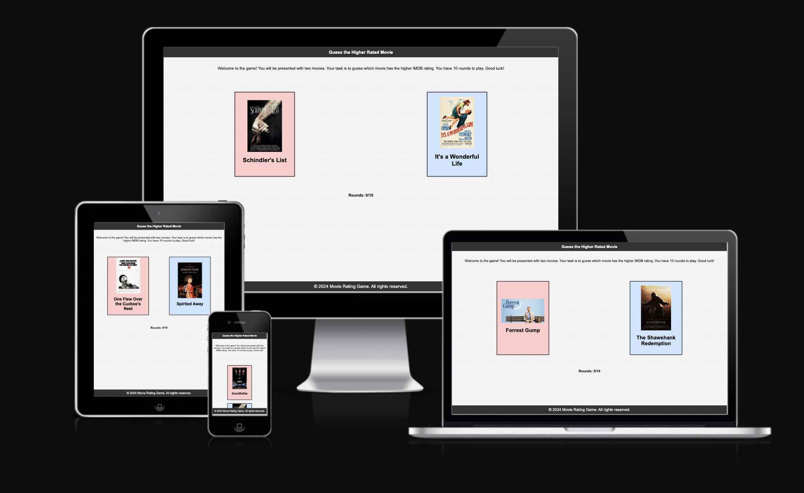
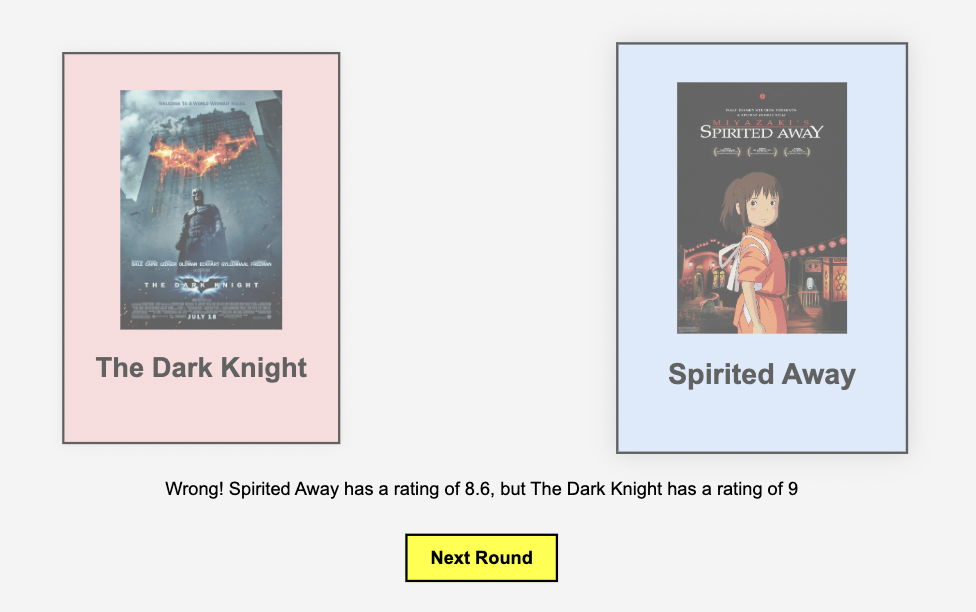
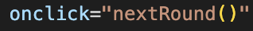
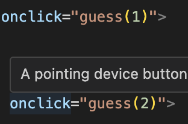
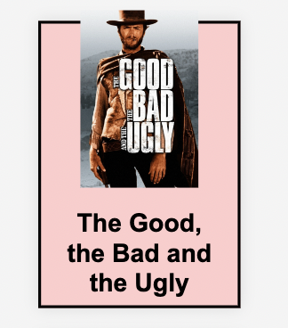
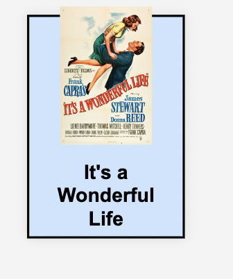

# Movie Rating Game

## Overview

Welcome to the Movie Rating Game! This game challenges you to guess which of two movies has a higher IMDb rating. You'll play 10 rounds, each featuring two different movies. Your goal is to guess correctly as many times as possible to achieve a high score and earn a title based on your performance.

## Features

### Display two random movies for each round.
### Allow users to guess which movie has a higher rating.

### Track score and rounds played.

### Show a "Next Round" button after each guess.

### Display the final score and title based on the user's performance.

### Titles: 
  - Cinephile (10/10)
  - Movie Buff (7-9/10)
  - Movie Fan (5-6/10)
  - Normie (0-4/10)

## Technologies Used

- HTML
- CSS
- JavaScript

## How to Play

1. You will be presented with two movies.
2. Click on the movie you think has the higher IMDb rating.
3. After guessing, you will see whether your guess was correct or not.
4. Click the "Next Round" button to proceed to the next pair of movies.
5. After 10 rounds, click the "Show Score" button to see your final score and title.

## Files and Directories

- `index.html`: The main HTML file for the game.
- `score.html`: The HTML file for displaying the final score.
- `assets/css/styles.css`: CSS file for styling the game page.
- `assets/css/score-styles.css`: CSS file for styling the score page.
- `assets/js/script.js`: JavaScript file containing the game logic.
- `assets/js/score-script.js`: JavaScript file containing the score page logic.
- `assets/images/`: Directory containing movie images.

## Deployment
Github

This project is deployed using GitHub pages using the following process,

Deploying a GitHub Repository via GitHub Pages

In your Repository section, select the Repository you wish to deploy.
In the top horizontal Menu, locate and click the Settings link.
Inside the Setting page, around halfway down locate the GitHub Pages Section.
Under Source, select the None tab and change it to Main and click Save.
Finally once the page resets scroll back down to the GitHub Pages Section to see the following message "Your site is ready to be published at (Link to the GitHub Page Web Address)". It can take time for the link to open your project initially, so please don't be worried if it down not load immediately.

Forking the Github Repository

You can fork a GitHub Repository to make a copy of the original repository to view or make changes without it affecting the original repository.

Find the GitHub repository.
At the top of the page to the right, under your account, click the Fork button.
You will now have a copy of the repository in your GitHub account.

Making a Local Clone

Find the GitHub Repository.
Click the Code button
Copy the link shown.
In Gitpod, change the directory to the location you would like the cloned directory to be located.
Type git clone, and paste the link you copied in step 3.
Press Enter to have the local clone created.

## Testing

- Tested the game in dev tools to chec kresponsiveness and made changes accordingly.
- Confirmed that the score works correctly, along with titels and that the game runs without bugs.
- Confirmed that the text, header, footer and instructions are easily legible and understood by sharing with friends.
- Confirmed that the fonts and colors were easily legible by running it through dev tools.

- Lighthouse Dev Tools

### Testing in Lighthouse returned undesirable results.

### As we can see there was no viewport code. After I added the initial viewport structure I got the following score.

### And then I added the media queries as well as changed the font size and got the following score.

### Changed the color from Blue + Red, to a Lightblue + Lightred per dev tools.

- HTML 
   - No bugs, only img src errors in HTML code, but using them in a function in JS instead to make the game functionable.
- CSS
   - No bugs, and no errors.
- JS
   - No bugs. But two "unused variables" for function 'guess' & 'nextRound'. 

## BUGS

- I noticed that I could just press the same movie over and over without it changing unless I pressed Next Round. So I figured out a way to freeze the guessing buttons, enabling only the Next Round button to continue the game, making the movie-card slightly translucent to indicate that it is out of access.

## UNFIXED-BUGS

- The renameing proccess didn't work and the image pathwasy couldn't find eachother after I changed names to "skewer kebab" style naming. So I switched it back. Next time I'll start with correct naming style.

## Known-issues

- These are actually used but as events in the HTML code. Validated JS, had two "unused variables", 'guess'(line 68 in script.js) and 'nextRound', (line 94 in script.js), are being called within html on (line 22, 23 & 26). 
Same with score.js file, it’s part of an onlick. If I had the time I'd change them to eventlisteners within the JS-files.
   
   

- When viewed on the phone, some images scale outside the movie.card divs, because of the movie titels becoming to long and pushing them out, but doesn't hidner the logic or the bug the game.

   
   

## Changes after Mentor Meet

- Renamed javascript and css files. From "script.js = index.js", "styles.css = index.css", "styles.score.css = score.css"

- Add structure comments to css. 

- Add structure comments to JS.

- Add structure comments to HTML.

- Move inline styling from HTML to CSS file.

- Rename images assets, "kebab" ("-") names, instead of "_".

- Remove console.logs().

- Screenshots for features.

- Change ”setup” to ”deployment”.

- Add known issues to TESTING.

## CREDITS

### Harry (Mentor)
- Harry helped me better strucutre my code with comments and helped me edit some final details that made the whole project come together a bit better.

### Media
- All media for movie images was taken from IMDB pages and google search.

